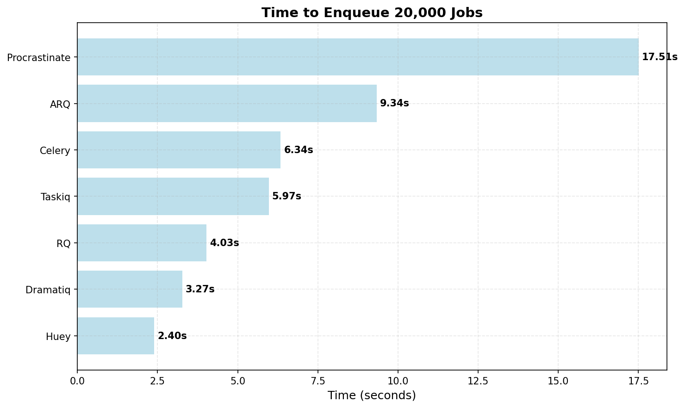
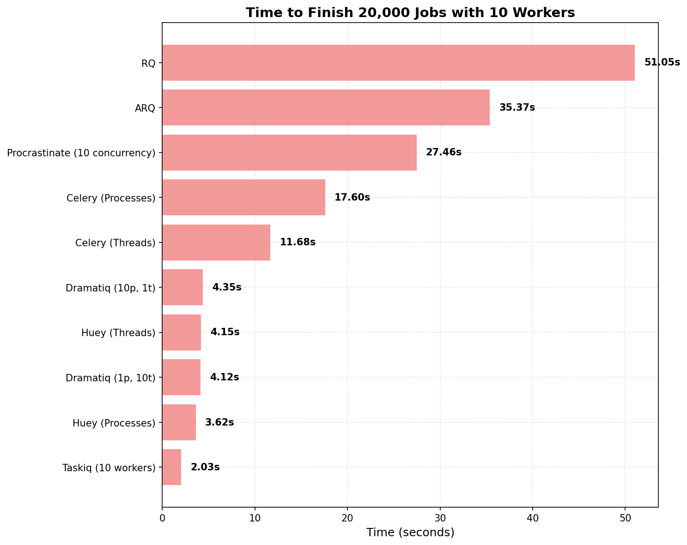

# Load Benchmark on Various Task Queues in Python

This repository contains scripts for load testing various Python task queue libraries.

The purpose of these tests is to provide a general sense of the performance and scalability of different task queue systems under heavy loads.

Additionally, I am exploring how to use each library as a user, evaluating how easy they are to set up, how intuitive their APIs are, and the overall user experience with their CLI.

Note that these tests are not critical evaluations but rather exploratory assessments to give a general feel of how each system performs.

The task queue libraries in this benchmark:

- [RQ (Redis Queue)](https://python-rq.org/)
- [ARQ (Async Redis Queue)](https://arq-docs.helpmanual.io/)
- [Celery](https://docs.celeryq.dev/en/main/getting-started/introduction.html)
- [Huey](https://huey.readthedocs.io/en/latest/)
- [Dramatiq](https://dramatiq.io/index.html)
- [Taskiq](https://taskiq-python.github.io/)

## Test Method

The benchmark is very naive, it measure the total time spent on processing `20,000` jobs by `10` workers. Each job simply prints the current time.

All tests were conducted on a MacBook Pro 14 inch M2 Pro with 16GB of RAM.

### Time to Enqueue 20,000 Jobs



### Time to Finish 20,000 Jobs with 10 Workers



## Prerequisites

Before running the tests, ensure you have Docker installed. Start Redis using Docker Compose:

```bash
docker compose up
```

Install [uv](https://github.com/astral-sh/uv), and then run:

```bash
uv sync

source .venv/bin/activate
```

## RQ

1. Navigate to the RQ directory:
   ```bash
   cd rq
   ```
2. Enqueue the jobs:
   ```bash
   python enqueue_jobs.py
   ```
3. Process jobs:
   ```bash
   python -c "import time; print(f'Start time: {time.time()}')" > time.log && rq worker-pool -q -n 10
   ```
4. Record the time when the last job finishes and note the start time in `time.log`.
5. Calculate the difference.

### Results

- All jobs enqueued within: 4.03 seconds
- With 10 workers, finished in 51.05 seconds


## ARQ

1. Navigate to the ARQ directory:
   ```bash
   cd arq
   ```
2. Enqueue the jobs:
   ```bash
   python enqueue_jobs.py
   ```
3. ARQ has no built-in support for running multiple workers, so we use `supervisord`:
  ```bash
    python -c "import time; print(f'Start time: {time.time()}')" > time.log && supervisord -c supervisord.conf
  ```
4. Record the time when the last job finishes and note the start time in `time.log`.
5. Calculate the difference.

### Results

- All jobs enqueued within: 9.34 seconds
- With 10 workers, finished in 35.37 seconds


## Celery

1. Navigate to the Celery directory:
   ```bash
   cd celery
   ```
2. Enqueue the jobs:
   ```bash
   python enqueue_jobs.py
   ```
3. Process jobs:
```bash
python -c "import time; print(f'Start time: {time.time()}')" > time.log && celery -q --skip-checks -A tasks worker --loglevel=info -c 10 -P threads
```
4. Record the time when the last job finishes and note the start time in `time.log`.
5. Calculate the difference.

### Results

- All jobs enqueued within: 6.34 seconds
- With 10 thread workers, finished in 11.68 seconds
- With 10 process workers (`-P processes`), finished in 17.60 seconds


## Huey

1. Navigate to the Huey directory:
   ```bash
   cd huey
   ```
2. Enqueue the jobs:
   ```bash
   python enqueue_jobs.py
   ```
3. Process jobs:
   ```bash
   python -c "import time; print(f'Start time: {time.time()}')" > time.log && huey_consumer.py tasks.huey -k thread -w 10 -d 0.001 -C -q
   ```
4. Record the time when the last job finishes and note the start time in `time.log`.
5. Calculate the difference.

### Results

- All jobs enqueued within: 2.40 seconds
- With 10 thread workers, finished in 4.15 seconds
- With 10 process workers (`-k process -w 10 -d 0.001 -C -q`), finished in 3.62 seconds

## Dramatiq

1. Navigate to the Dramatiq directory:
   ```bash
   cd dramatiq
   ```
2. Enqueue the jobs:
   ```bash
   python enqueue_jobs.py
   ```
3. Process jobs:
   ```bash
   python -c "import time; print(f'Start time: {time.time()}')" > time.log && dramatiq tasks -p 1 -t 10
   ```
4. Record the time when the last job finishes and note the start time in `time.log`.
5. Calculate the difference.

### Results

- All jobs enqueued within: 3.27 seconds
- With 1 process and 10 threads, finished in 4.12 seconds
- With 10 process and 1 threads, finished in 4.35 seconds
- With default settings (10 processes, 8 threads), finished in 1.53 seconds

## Taskiq

The taskiq is set up using the `RedisStreamBroker` from `taskiq-redis`.

1. Navigate to the Taskiq directory:
   ```bash
   cd taskiq
   ```
2. Enqueue the jobs:
   ```bash
   python enqueue_jobs.py
   ```
3. Process jobs:
   ```bash
   python -c "import time; print(f'Start time: {time.time()}')" > time.log && taskiq worker --workers 10 tasks:broker
   ```
4. Record the time when the last job finishes and note the start time in `time.log`.
5. Calculate the difference.

### Results

- All jobs enqueued within: 5.97 seconds
- With 10 workers, finished in 2.03 seconds


## TODO

- Get the time from stored results in the queue, so that the whole process can be automated.
- Test in larger size, and verify failures, error handlings.